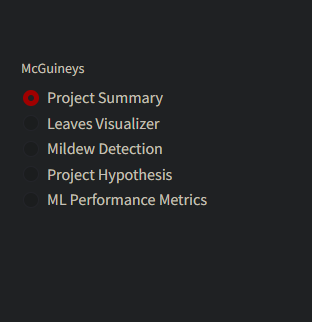

# Mildew Detection in Cherry Leaves

## Dataset Overview

The dataset, originating from Kaggle, comprises over 4,000 images extracted from Farmy & Foods' crop fields. The images feature cherry leaves, both healthy and affected by powdery mildew—a fungal disease impacting various plants. The cherry plantation is a key product for the company, and ensuring the supply of high-quality produce to the market is a priority.

## Business Requirements

Farmy & Foods faces a challenge with powdery mildew affecting their cherry plantations. The current manual inspection process is time-consuming, with an employee spending 30 minutes per tree. To address this, the IT team proposed a machine learning (ML) system for instant detection of mildew in cherry leaves. The success of this initiative could potentially extend to other crops.

## Objectives

1. Differentiate between healthy and powdery mildew-infected cherry leaves.
2. Predict whether a cherry leaf is healthy or affected by powdery mildew.

## Hypothesis and Validation

**Hypothesis:** Achieve high accuracy (>97%) in distinguishing leaves with and without mildew using an ML model.

**Validation:** A balanced dataset with a 70% training, 20% validation, and 10% test split. The algorithm should recognize patterns rather than memorizing, ensuring effectiveness.

## Rationale for Data Visualizations and ML Tasks

- **Visually Differentiate:** Automate visual differences between healthy and unhealthy cherry leaves using grayscale.
  
- **Predicting Algorithm:** ML model classifies leaves as with or without mildew based on nominal categorical variables.

## ML Business Case

Stakeholders proposed the ML solution to study visual differences in leaves, expecting a match rate of over 97%. The deep convolutional neural network model performed well, providing results deployed on Heroku to streamline employee workflows.

## Data Understanding

- Images uniformly sized at 256x256 pixels.
- Augmentation simulates different viewpoints through stretching, rotating, and zooming.
- No further indexing needed for modeling due to the binary nature of the target variable.

## Modeling

**Model Architecture:**
- TensorFlow and Keras utilized for modeling.
- Sequential model with Feature Learning (convolutional layers) and Classification (dense layers).
- Filters in Feature Learning identify features like lines and color differences.
- Classification section uses a sigmoid function for binary output.

## Dashboard Design

- Streamlit library for a responsive design.
- Sidebar with radio boxes for different sections:
  - Project Summary
  - Leaves Visualizer
  - Mildew Detection
  - Project Hypothesis
  - ML Performance Metrics
  
   

## Evaluation

The ML model effectively detects mildew in cherry leaves, providing accurate and efficient results. Recommended to expand the algorithm for broader leaf identification.

## Deployment

Deployed on Heroku at [Mildew Detection App]().

## Main Libraries Used

 **numpy 1.26.3:**
   - NumPy: Powerful numerical computing library for large, multi-dimensional arrays.

 **pandas 2.1.4:**
   - Pandas: Data manipulation and analysis library with DataFrame and Series structures.

 **matplotlib 3.8.2:**
   - Matplotlib: 2D plotting library for creating static, animated, and interactive visualizations.

 **seaborn 0.13.1:**
   - Seaborn: Statistical data visualization library based on Matplotlib, simplifying complex visualizations.

 **streamlit 1.30.0:**
   - Streamlit: Framework for creating web apps with minimal effort, ideal for interactive data applications.

 **tensorflow 2.15.0:**
   - TensorFlow: Open-source machine learning library with a comprehensive ecosystem for building and training models.

 **keras 2.15.0:**
   - Keras: High-level neural networks API running on TensorFlow and Theano, simplifying deep learning model development.

## Credits

- Dataset sourced from Kaggle.